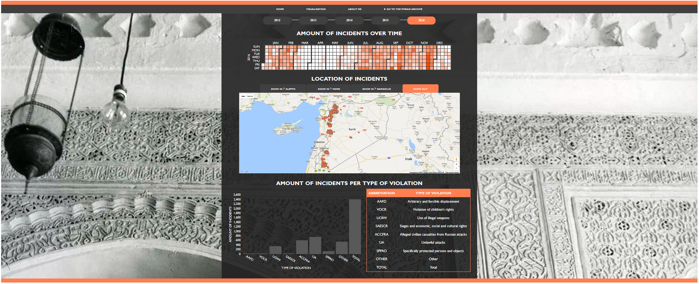

#REPORT

##DESCRIPTION OF VISUALISATION

The Syrian Archive is an initiative launched by a collective of human rights activists dedicated to preserving open source documentation relating to human rights violations and other crimes committed by all sides during the conflict in Syria. Their goal is to preserve the most valuable material to ensure it is organized and accessible for use by current researchers, journalists and others with an interest in the conflict as well as to facilitate the work of future historians and investigators involved in transitional justice and accountability efforts.

Information about the incidents which are included in the The Syrian Archive is visualised. The goal of the visualisation is to increase awareness of the scale of the human rights violations in Syria and to obtain more insight into the background of the incidents. Each visualisation has been carefully picked to highlight a different aspect of the incidents background information:

* When

The **Calendar Heatmap** can be utilised to see the amount of incidents over time. How many incidents took place on one day? How did the amount of incidents develop over time?

* Where

The **Map of Syria** gives more insight into where the incidents took place. This visualisation is also useful when more information about only one incident is demanded. When did that particular incident take place? What is the type of violation? What happened?

* What

The **Barchart** displays the amount of incidents per type of violation. What is the most common type of violation? Does the amount of incidents per type of violation change over the years?

##TECHNICAL DESIGN

###High level overview
My visualisation is styled in the webbrowser **Firefox** zoomed at **60%**.

* Timeline

Click on the buttons of the timeline to explore the data over different years.

* Calendar Heatmap

The darkness of a day indicates the amount of incidents that occured on that particular day. Hover over the days to see the exact amount of incidents on that day. The Map of Syria will now only show the incidents that took place on that specific day.

* Map

Click on a circle on the Map of Syria to see more details about a specific incident. Click on the zoom buttons to explore more details about incidents which took place in a specific city. Hover over the circles on the Map of Syria to see in the Calendar Heatmap on which day the incident took place. The incidents where no latitude and/or longitude were available are not shown on the Map of Syria:

2016: 894 incidents not shown | 2015: 29 incidents not shown | 2014: 13 incidents not shown | 2013: 2 incidents not shown | 2012: 0 incidents not shown

* Barchart and Table

Hover over the bars of the barchart or hover over the rows of the table to see the exact amount of incidents per type of violation. Read in the table what the abbreviations on the x-axis of the barchart means.

###Detail

* calendar.js

* map.js

* barchart.js

Second, go into detail, and describe the modules/classes and how they relate.

##CHALLENGES

* Scraping the data
I had some difficulties with scraping the webpage of the Syrian Archive. I had to scrape multiple pages which I never did before. Later in the process I found out that I also had to scrape the latitude and longitude of each incident to place circles on the map of Syria. I had to change my Python script and scrape the website again. When I placed the circles on the map, I found out that something went wrong with scraping the website. Some incidents were scraped twice. I did not find a bug in my Python script but when I runned the scraper.py script again the problem was solved.

* Timeslider
I had difficulties with implementing a timeslider, which made me decide to make timebuttons instead. This was a lot easier to implement and the functionality is the same.

* Calendar Heatmap
During the process of linking the map of Syria with the calendar heatmap I found out that I had to change the way I implemented the tooltip of my calendar heatmap. While hovering over the cirles on the map, the tooltip of the calendar view appeared but on the wrong location of the screen. The location of tooltip I used was relative to the location of the cursor, but I had to change this to the location of the corresponding rectangle in the calendar heatmap. I used an outdatet version of d3tip.js and after using the newest version the bug was solved.

* Map
One of the biggest problems I had with the map of Syria 
 stippen die geen latitude en/of longitude hebben + stippen met exact dezelfde coordinaten,  Ik ben erachter gekomen dat er nog een bug in mijn map zit... Ze hebben in de database van meerdere notaties gebruik gemaakt om coördinaten aan te geven. Ik heb dit weekend dus tijd besteed om mijn python script (makedatamap.py) aan te passen, zodat deze coördinaten omgezet worden naar de juiste notatie. Daarbij is deze bug opgelost.

 Problemen gehad met de tooltip omdat google kut is

 Door de stippen onzichtbaar te maken kwam ik er wel achter dat de stippen waarvan geen coordinaten beschikbaar zijn allemaal in oktober/november zitten. Als je daar hovert over een dag waarbij 40+ incidenten zijn plaatsgevonden dan verdwijnen alle stippen op de kaart. Ik ga dit duidelijk vermelden in de tekst die bij mijn visualisatie hoort hoeveel stippen er per jaar niet worden weergeven.

 Bug in mijn map: als je met de + en - knoppen inzoomt dan kan je niet meer slepen met het handje. Ook gebeuren er dan gekke dingen met mijn kaart.

* Barchart and Table
Barchart en table: als je op de tabel gaat staan verscheen de tooltip rechts bovenin de hoek

##DECISIONS

Defend your decisions by writing an argument of a most a single paragraph. Why was it good to do it different than you thought before? Are there trade-offs for your current solution? In an ideal world, given much more time, would you choose another solution?

##IN AN IDEAL WORLD...
Daarnaast is het jammer dat zodra je weer van de calendar af hovert alle stippen weer verschijnen. Je kunt nu dus niet de tooltip bekijken van een incident op een specifieke datum. Dit kun je wel doen door niet een on hover te maken maar een on click. Het probleem is dan echter dat de stippen die ik onzichtbaar maak niet verdwenen zijn van de kaart, dus als je dan op een stip wilt klikken dan kun je ook (per ongeluk) op een onzichtbare stip klikken en dan krijg je de verkeerde tooltip te zien. Je kunt de stippen die moeten verdwijnen ook daadwerkelijk van de kaart afhalen, maar dit is zo'n gedoe dat ik hier helaas geen tijd meer voor heb. Dit zal ik meenemen voor mijn verslag voor dingen die ik nog had willen doen.

In plaats van in de tekst aan te geven hoeveel stippen per jaar niet worden weergeven op de kaart is het mooi als je dit in de tooltip van de calendar per dag kunt laten zien. Dit is inderdaad een mooi idee, maar hier ga ik geen tijd meer voor hebben. Dit zal ik meenemen voor in mijn verslag voor dingen die ik nog had willen doen.

Ik zou het vet vinden om de functionaliteit van de barchart nog af kunnen krijgen (dat als je op een bar klikt van een bepaald incident dat je in de kaart en in de calendar alleen nog de incidenten van dat type incident ziet), maar ik weet niet of dit realistisch is. Ik kreeg als tip eerst mijn pagina af te maken qua tekst en opmaak, het verslag te schrijven en als ik dan nog tijd over heb kan ik altijd nog naar die filter kijken.

Dingen die ik graag had willen doen:
* Vaste menubar
* Filteren van barchart
